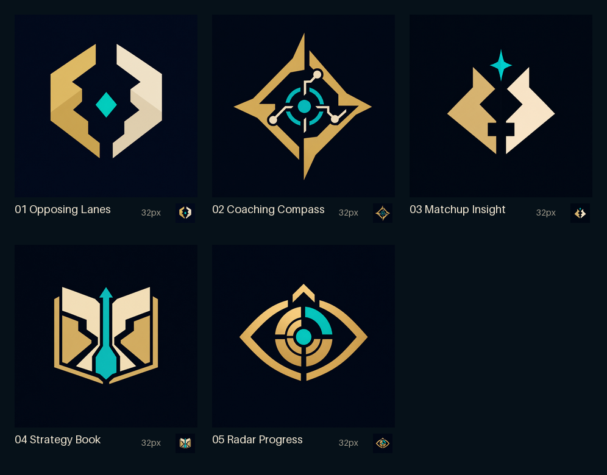

# LoL Matchup Coach logo concepts

Five original, icon-first logo directions generated for the app's existing dark navy, gold,
and teal interface. **Opposing Lanes was selected and redrawn as the production SVG in
[`public/brand-mark.svg`](../../public/brand-mark.svg).** The remaining raster concepts are kept
here as exploration history.

## Directions

1. **Opposing Lanes** — Two interlocking paths frame a teal waypoint. The strongest all-purpose
   app icon: simple, balanced, and immediately readable at small sizes.
2. **Coaching Compass** — A tactical compass and connected map nodes. The most detailed option;
   it emphasizes navigation and active guidance.
3. **Matchup Insight** — Two abstract sides face each other beneath an insight spark. The most
   compact matchup-focused mark and a strong tray-icon candidate.
4. **Strategy Book** — An open book becomes two lanes around an upward path. The clearest expression
   of the app's teaching mission.
5. **Radar Progress** — An analytical eye/radar with an upward marker. Best aligned with the app's
   match analysis, history, and improvement features.

## Recommendation

Start production refinement with **Opposing Lanes**. It has the most distinct silhouette, survives
32px reduction well, and can represent matchup, direction, and the player's central decision point
without relying on a literal game or coaching symbol. Keep **Strategy Book** as the alternate if the
brand should lean more educational than tactical.

## Generation prompt set

All five used the built-in image generator with this shared brief:

> Square product logo concept and desktop app icon for “LoL Matchup Coach,” a local teaching companion
> that gives tactical matchup guidance and tracks player improvement. Clean vector-friendly geometric
> logo, flat shapes, crisp hard edges, premium game-tool identity, strong silhouette, minimal detail,
> suitable for recreation as SVG. One centered emblem only with generous padding on a flat deep
> navy-black background. Palette: #010A13, #0A1428, #C8AA6E, #F0E6D2, and one #0AC8B9 accent. No text,
> letters, or numbers. Original non-infringing design, legible at 32px. Avoid official League or Riot
> marks, champion imagery, weapons, crowns, laurels, wings, mascots, generic esports shields,
> photorealism, 3D effects, gloss, drop shadows, watermarks, and tiny linework.

The concept-specific additions were:

- **Opposing Lanes:** Two opposing angular lane-path chevrons lock around a teal waypoint diamond;
  negative space suggests a fair one-versus-one matchup and forward movement.
- **Coaching Compass:** A simplified coaching compass and tactical map node with four restrained
  direction points, a gold structure, and one teal center signal.
- **Matchup Insight:** Two abstract geometric profile-like wedges face across a narrow center line,
  with a small teal insight spark above their meeting point.
- **Strategy Book:** An open strategy book whose pages also read as opposing lanes, with the center
  seam becoming a teal upward path.
- **Radar Progress:** An angular tactical radar-eye frame, teal central node, and upward notch that
  communicate analysis, learning, and improvement without mystical or surveillance imagery.
